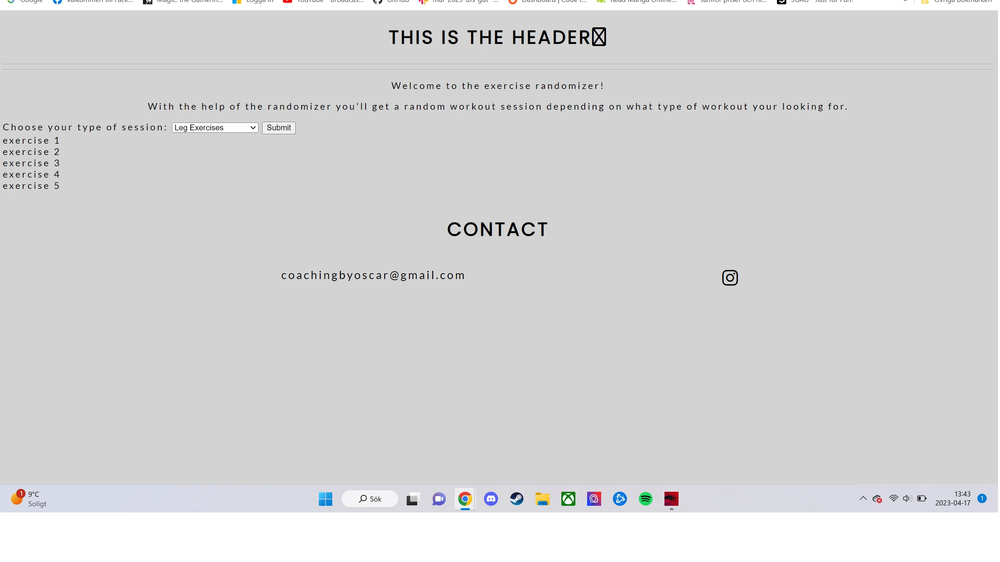
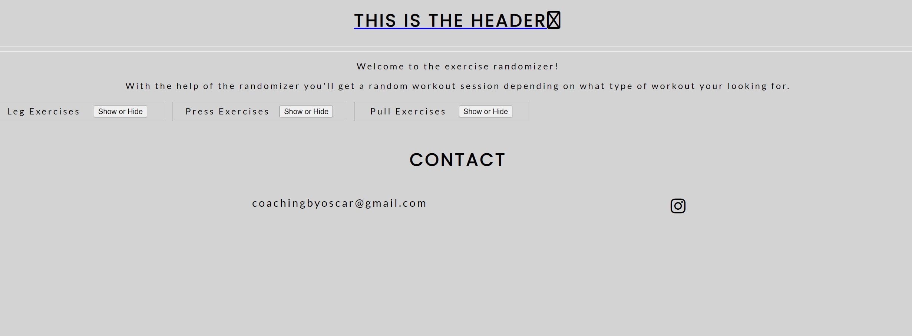
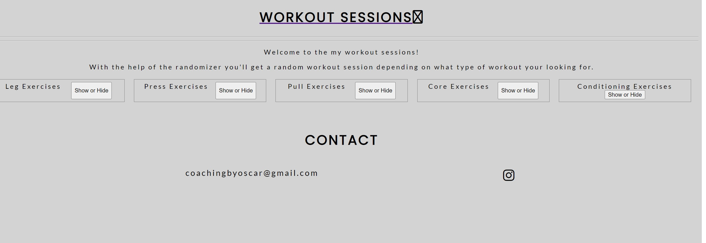
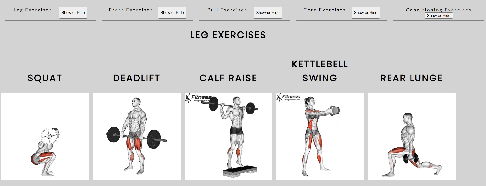
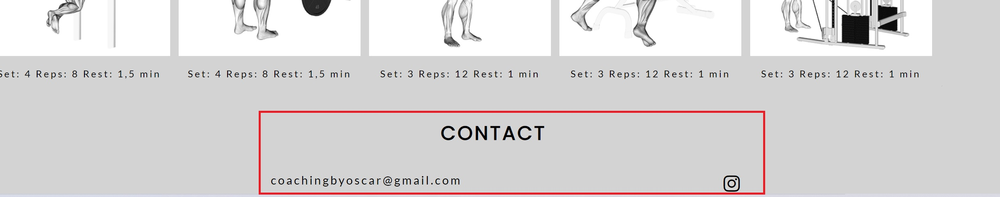
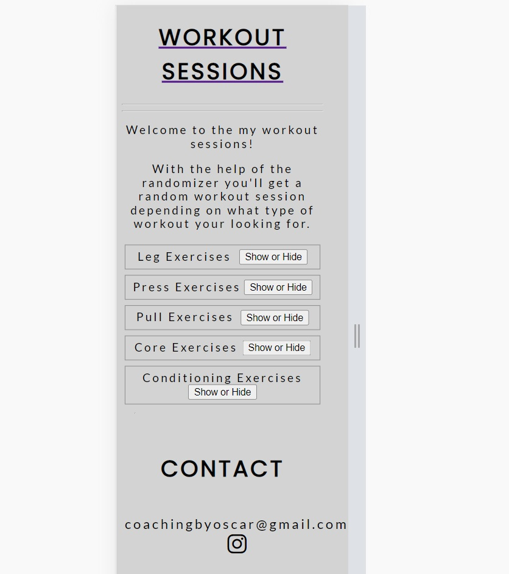

# My Randomizer

## Purpose of the site

My mission here is to create a site with the purpose to generate a small session depending which muscle group the user chooses.
The function the site revolves around is a toggle function the shows/hides the sessions, by default it's hidden.
Each session gets 5 exercises (2 compound movements and 3 more specific exercises).

The target audience are people with earlier knowledge or experience of working out who wanna try a new kind of session or just get som inspiration.

## Screenshots of the process

The sites basics are getting into formation, i've decide put a a light grey background as the backdrop and I think i will implement some kind of set/rep/rest table to with the sessions.

Rewrote most of the site and switched out the dropdown menu and now it looks something like this:

Basic layout of the site:

Page when one of the buttons are pressed:

The footer:

## Testing
- Home page
    - Tested the logo to restart the home page.
    - Tested the link to instagram, worked both in full screen and responsive mode.
    - Tested the button in both fullscreen and responsive mode.
    - Pictures flows fine in smaller versions too, picture down below.

### Validator Testing
 - HTML
    - no errors were found when passing through the official [W3C validator](https://validator.w3.org/nu/?doc=https%3A%2F%2Frakdoslover.github.io%2Fproject_randomizer%2F) validator.
 - CSS
    - No errors were found when passing through the official [(Jigsaw) validator](https://jigsaw.w3.org/css-validator/validator?uri=https%3A%2F%2Frakdoslover.github.io%2Fproject_randomizer%2F&profile=css3svg&usermedium=all&warning=1&vextwarning=&lang=sv) validator.

## Deployment
- The site was deployed to GitHub pages. The steps to deploy are as follows:
    - In the GitHub repository associated with the project_randomizer, navigate to the Settings tab.
    - From the branch section drop-down menu, select the Main Branch and press save.
    - Once the Main branch has been selected, the page will be automatically refreshed with a detailed ribbon display to indicate the successful deployment.

The live link can be found here: https://rakdoslover.github.io/project_randomizer/

## Sources

1. The GIFs that i didn't already own are marked with "Fitness-Programmer.com", they own the originals and you can find the images through this link [Fitness Programmer](https://fitnessprogramer.com/#).
2. Found info on the toggle funtion through Stackoverflow and their "Ask section", [Stackoverflow](https://stackoverflow.com/questions/).
3. Reused old code from former projects to create base structure and the idea of flex boxes, you can find most of the info i got here [CSS-TRICKS](https://css-tricks.com/snippets/css/a-guide-to-flexbox/).
4. I've also used the template made by CI published on Github as a layout, can be found here [GitHub](https://github.com/Code-Institute-Solutions/love-running-2.0-sourcecode).